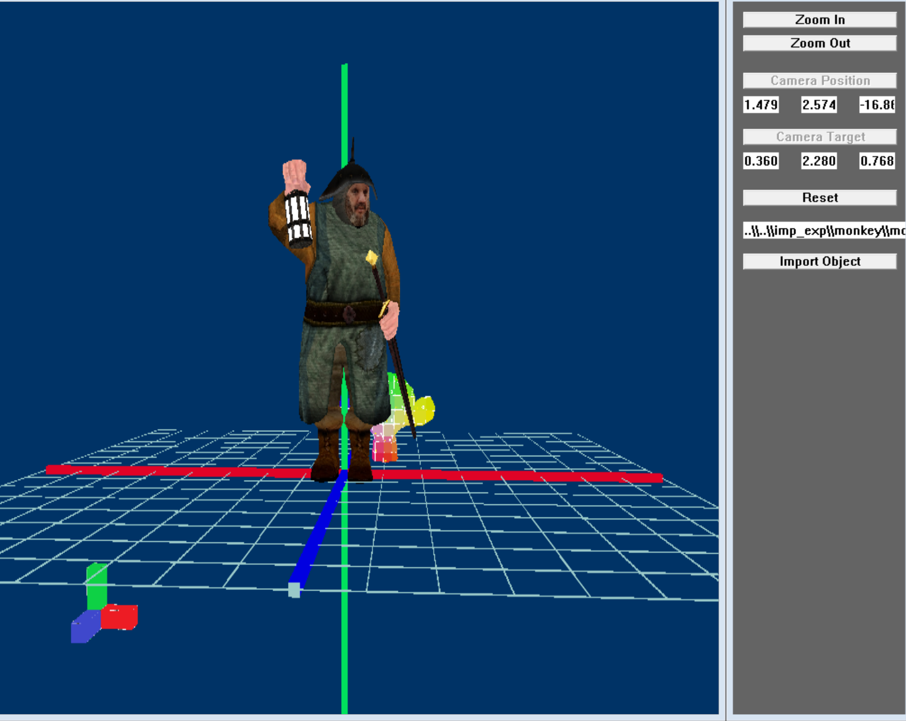
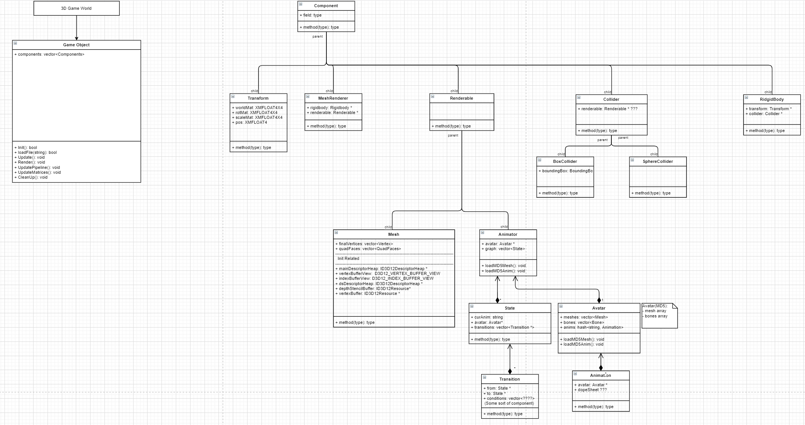

# DX12 Object Loader

An object loader that can display models in a 3d space using the DX12 library. 

  

Features
--------

- Load 3d models from **.obj** and **.md5mesh** files.
- Camera movement (**rotating**, **panning**, **translating**, **zooming**).
- **Animation** from **.md5anim** files using **gpu-skinning**.
- Load **multiple** 3d models at once in the same world.
- Create **custom** 3d models.

How it Works
------------
1. Component based system is used to give the 3d models different attirbutes. These attributes store data of the 3d model such as animation frame data and uv texture coordinate data.

  

2. Positional data of 3d models during an animation are calculated using bone armatures and weighted vertices. Each frame, the bones in the bone armature are translated and rotated to a different position, and each bone applies a different weight to every vertex in the 3d model which determines how much the vertex should move according to that specific bone. 

3. Animations are handled on `VertexShader.hlsl` via the process of gpu-skinning.  

How to Use
----------

Build and run program using Visaul Studios.

Staff
-----

- Programmer: Joon Kang
- Mentor: Samil Chai

Work Period
-----------

- Start Date: 2018-03-11
- End Date: 2019-01-13

Privacy
-------

*Portions of source code have been removed for privacy purposes.*

